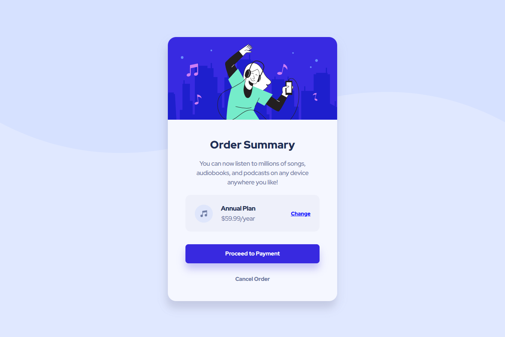

# FM_project_2

# Frontend Mentor - Order summary card solution

This is a solution to the [Order summary card challenge on Frontend Mentor](https://www.frontendmentor.io/challenges/order-summary-component-QlPmajDUj). Frontend Mentor

## Overview

### The challenge

Users should be able to:

- See hover states for interactive elements

### Screenshot

### Links

- Solution URL: [Add solution URL here](https://your-solution-url.com)
- Live Site URL: [https://shawn8z.github.io/FM_project_2/](https://shawn8z.github.io/FM_project_2/)

### Built with

- html
- css
- mobile-first workflow

### What I learned

1. Should place a:visited selector before any other action base selector, if not it will overwrite all selector`s styling before it.
2. Adding background image in CSS.
3. A better understanding of when and where should different types of units be used.
4. Understand how different font weight work in the same font family.

## Author

- Frontend Mentor - [@Shawn8z](https://www.frontendmentor.io/profile/Shawn8z)

